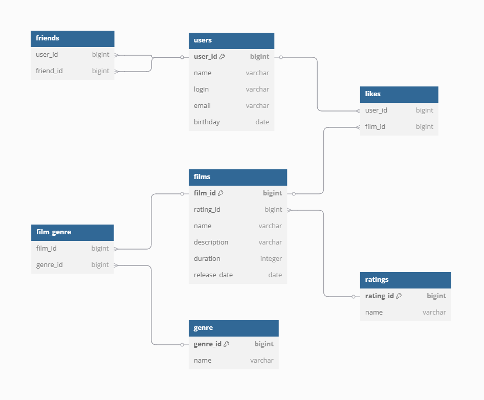

Описание БД 
===
___
В таблице ratings запись
- name varchar означает возрастное ограничение для фильма, G, PG, PG -13, R, NC-17 
___
 В таблице films записи
- description varchar - это описание фильма
- duration integer - это длительность в минутах
___
В таблице genres запись 
-  name varchar – это жанр: комедия, боевик и т.д
___
Таблица film_genre является связующей для таблиц films и genre
___
Таблица likes является связующей для таблиц users и films   
___
