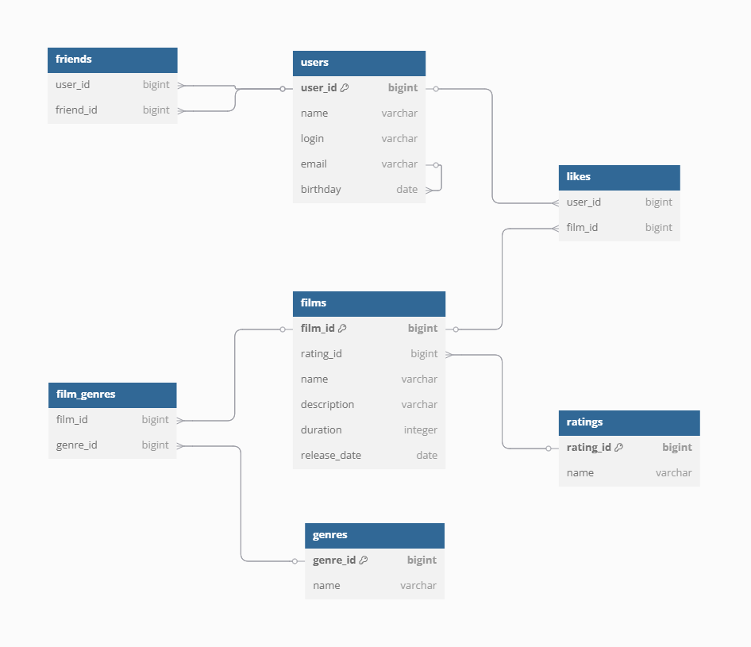

Описание БД 

В таблице ratings запись
- name varchar означает возрастное ограничение для фильма, G, PG, PG -13, R, NC-17 

 В таблице films записи
- description varchar - это описание фильма
- duration integer - это длительность в минутах

В таблице genres запись 
-  name varchar – это жанр: комедия, боевик и т.д

Таблица film_genres является связующей для таблиц films и genres

Таблица likes является связующей для таблиц users и films   

